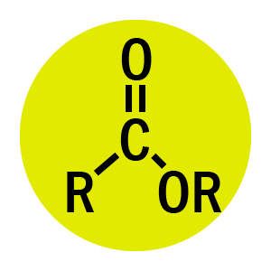

<div align="center">
  <br>
  <b>明日方舟技能图标识别</b>
  <h1>⚗ OriginumAlchemy 源石炼金学</h1>
</div>

## 任务描述

明日方舟技能图标分类问题。

## Dataset

位于 `./icons` 文件夹。

数据集下载 / 更新：

```bash
python utils/download_icons.py
```

## Data Augmentation

随机调整灰度 50% - 100%。

## Architecture

使用 `resnet18` 的 `backbone`，重新设计 `bottleneck` 以及输入尺寸。

## Training

```bash
python training_script.py
```

## Results

* Dataset Acc: 100%
* Dataset Acc (with 10x data-aug): 100%

## Parameter Tuning

```python
batch_size = 64         # batch_size
img_size_scale = 3      # input scale, 输入大小即为 (32*scale) * (32*scale), 因为 resnet 有 32 倍下采样
num_epoch = 400         # epoch 数
warmup_epoch = 30       # 线性 warmup epoch 数
max_lr = 0.1            # 最大学习率
weight_decay = 0.0005
momentum = 0.9
```
